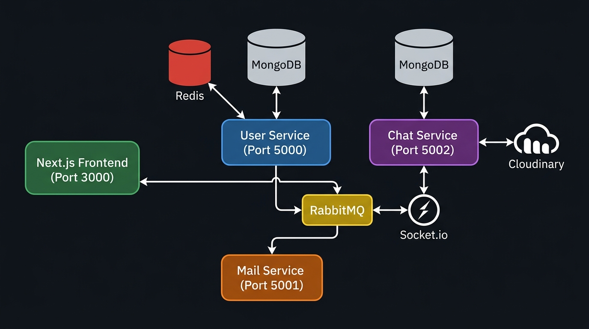
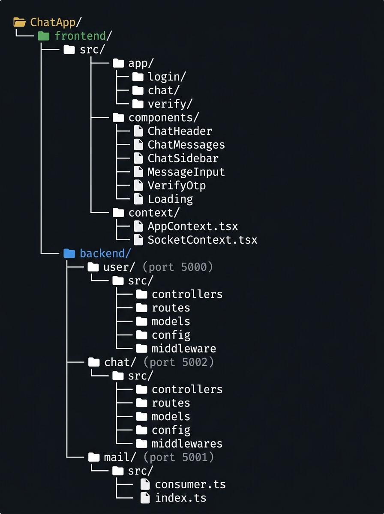
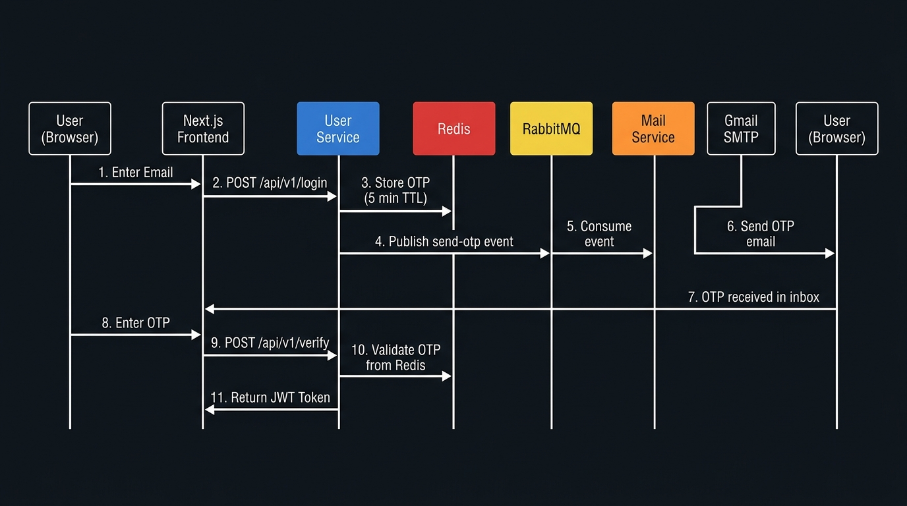

# 💬 ChatApp — Real-Time Microservices Chat Application

A full-stack, production-ready **real-time chat application** built with a **microservices architecture**. Features passwordless OTP email authentication, real-time messaging with Socket.io, image sharing via Cloudinary, and asynchronous email delivery via RabbitMQ.

---

## 📸 Project Overview

| Feature | Detail |
|---|---|
| Architecture | Microservices (3 independent backend services) |
| Authentication | Passwordless OTP via Email (no passwords stored) |
| Real-time | WebSocket (Socket.io) with online presence tracking |
| Message Types | Text & Images |
| Image Storage | Cloudinary CDN |
| Message Queue | RabbitMQ (async OTP email delivery) |
| Caching | Redis (OTP store + rate limiting) |
| Frontend | Next.js 16 + React 19 + Tailwind CSS v4 |
| Backend | Node.js + Express + TypeScript |
| Database | MongoDB (separate DBs per service) |

---

## 🏗️ System Architecture



The application is divided into **three independent backend microservices**, each with its own database and responsibility:

| Service | Port | Role |
|---|---|---|
| **User Service** | `5000` | Authentication, user profiles, JWT tokens |
| **Chat Service** | `5002` | Messaging, chat rooms, Socket.io, media uploads |
| **Mail Service** | `5001` | Consumes RabbitMQ queue and sends OTP emails |

### How Services Communicate

- **User Service ↔ Mail Service**: Asynchronously via **RabbitMQ** (`send-otp` queue). The User Service publishes OTP email jobs; the Mail Service consumes and delivers them.
- **Chat Service → User Service**: Synchronously via **HTTP (Axios)** to fetch user profile data when listing chats/messages.
- **Frontend ↔ Chat Service**: Real-time bidirectional communication via **Socket.io WebSockets**.

---

## 📁 Project Structure



```
ChatApp/
├── frontend/                     # Next.js 16 client app
│   └── src/
│       ├── app/
│       │   ├── login/            # Email login page
│       │   ├── verify/           # OTP verification page
│       │   └── chat/             # Main chat interface
│       ├── components/
│       │   ├── ChatHeader.tsx    # Top bar with user info & online status
│       │   ├── ChatMessages.tsx  # Message list with seen indicators
│       │   ├── ChatSidebar.tsx   # Conversations list & user search
│       │   ├── MessageInput.tsx  # Text/image message composer
│       │   ├── VerifyOtp.tsx     # OTP input form
│       │   └── Loading.tsx       # Loading spinner
│       └── context/
│           ├── AppContext.tsx    # Global state (user, chats, auth)
│           └── SocketContext.tsx # Socket.io connection management
│
└── backend/
    ├── user/                     # User Service (Port 5000)
    │   └── src/
    │       ├── controllers/user.ts   # login, verify, profile, updateName
    │       ├── routes/user.ts        # Express routes
    │       ├── modal/User.ts         # Mongoose User schema
    │       ├── middleware/isAuth.ts  # JWT authentication middleware
    │       └── config/
    │           ├── db.ts             # MongoDB connection
    │           ├── generateToken.ts  # JWT generation
    │           └── rabbitmq.ts       # RabbitMQ publisher
    │
    ├── chat/                     # Chat Service (Port 5002)
    │   └── src/
    │       ├── controllers/chat.ts   # CRUD for chats & messages
    │       ├── routes/chat.ts        # Express routes
    │       ├── models/
    │       │   ├── chat.ts           # Chat room schema
    │       │   └── Messages.ts       # Message schema (text/image)
    │       ├── middlewares/
    │       │   ├── isAuth.ts         # JWT validation
    │       │   └── multer.ts         # Cloudinary upload middleware
    │       └── config/
    │           ├── db.ts             # MongoDB connection
    │           ├── socket.ts         # Socket.io setup
    │           └── cloudinary.ts     # Cloudinary config
    │
    └── mail/                     # Mail Service (Port 5001)
        └── src/
            ├── index.ts          # Service entry point
            └── consumer.ts       # RabbitMQ consumer → Nodemailer
```

---

## 🔐 Authentication Flow (Passwordless OTP)



1. User enters their **email address** on the login page
2. Frontend calls `POST /api/v1/login` on the **User Service**
3. User Service generates a **6-digit OTP**, stores it in **Redis** (5 min TTL)
4. A **rate limit key** is set in Redis (60s window) to prevent spam
5. OTP email job is published to the **RabbitMQ** `send-otp` queue
6. **Mail Service** consumes the queue and delivers the email via **Gmail SMTP** (Nodemailer)
7. User receives OTP in inbox and submits it via `POST /api/v1/verify`
8. User Service validates OTP from Redis, creates user if first login
9. A **signed JWT token** is returned and stored in cookies

---

## ⚡ Real-Time Features (Socket.io)

The Chat Service maintains a **persistent Socket.io server** alongside the REST API.

| Event | Direction | Description |
|---|---|---|
| `connection` | Client → Server | Maps `userId` → `socketId` for targeted delivery |
| `getOnlineUsers` | Server → All Clients | Broadcasts list of currently online user IDs |
| `joinChat` | Client → Server | Joins a chat room by `chatId` |
| `leaveChat` | Client → Server | Leaves a chat room |
| `typing` | Client → Server | Notifies chat room partner that user is typing |
| `stopTyping` | Client → Server | Notifies chat room partner that user stopped typing |
| `newMessage` | Server → Client | Pushes new message to sender and receiver in real time |
| `messagesSeen` | Server → Client | Notifies sender when their messages are read |
| `disconnect` | Client → Server | Removes user from online map, re-broadcasts online users |

---

## 🛠️ Tech Stack

### Frontend
| Technology | Version | Purpose |
|---|---|---|
| Next.js | 16.3.4 | React framework with App Router |
| React | 19.2.8 | UI library |
| TypeScript | ^5 | Type safety |
| Tailwind CSS | ^4 | Utility-first styling |
| Socket.io Client | ^4.8.3 | Real-time WebSocket communication |
| Axios | ^1.20.0 | HTTP requests to backend services |
| js-cookie | ^3.0.8 | JWT token storage in cookies |
| lucide-react | ^1.43.0 | Icon library |
| react-hot-toast | ^2.6.0 | Toast notifications |
| moment | ^2.30.1 | Date/time formatting |

### Backend (All Services)
| Technology | Version | Purpose |
|---|---|---|
| Node.js + Express | ^5.2.1 | HTTP server framework |
| TypeScript | — | Type-safe backend code |
| Mongoose | ^9.9.5 | MongoDB ODM |
| JSON Web Token | ^9.0.3 | Stateless authentication |
| dotenv | ^17.4.2 | Environment variable management |

### User Service — Additional
| Technology | Purpose |
|---|---|
| Redis (`redis` ^6.2.1) | OTP caching (5-min TTL) + request rate limiting |
| amqplib (`^2.0.1`) | RabbitMQ publisher for async email jobs |

### Chat Service — Additional
| Technology | Purpose |
|---|---|
| Socket.io (`^4.8.3`) | Real-time bidirectional messaging |
| Multer + multer-storage-cloudinary | Image upload middleware with direct cloud storage |
| Cloudinary (`^1.41.3`) | Image CDN and storage |
| Axios | HTTP calls to User Service for user profile data |

### Mail Service — Additional
| Technology | Purpose |
|---|---|
| amqplib (`^2.0.1`) | RabbitMQ consumer for OTP email jobs |
| Nodemailer (`^10.0.0`) | Email delivery via Gmail SMTP |

### Infrastructure
| Service | Purpose |
|---|---|
| MongoDB | Primary database (separate instance per service) |
| Redis | In-memory OTP store + rate limiter |
| RabbitMQ | Message broker for async email delivery |
| Cloudinary | Media/image CDN |

---

## 📡 API Reference

### User Service (`localhost:5000/api/v1`)

| Method | Endpoint | Auth | Description |
|---|---|---|---|
| `POST` | `/login` | ❌ | Send OTP to email |
| `POST` | `/verify` | ❌ | Verify OTP, get JWT token |
| `GET` | `/me` | ✅ | Get current user profile |
| `PUT` | `/update` | ✅ | Update display name |
| `GET` | `/user/all` | ✅ | Get all users |
| `GET` | `/user/:id` | ❌ | Get user by ID (internal use) |

### Chat Service (`localhost:5002/api/v1`)

| Method | Endpoint | Auth | Description |
|---|---|---|---|
| `POST` | `/chat/new` | ✅ | Create or retrieve 1-on-1 chat |
| `GET` | `/chat/all` | ✅ | Get all chats for current user |
| `POST` | `/message/send` | ✅ | Send text or image message |
| `GET` | `/message/:chatId` | ✅ | Get all messages in a chat (marks as seen) |

> All authenticated endpoints require `Authorization: Bearer <token>` header.

---

## 🗄️ Data Models

### User (`user` database)
```typescript
{
  name: string       // Display name (auto-generated from email on first login)
  email: string      // Unique email address
  createdAt: Date
  updatedAt: Date
}
```

### Chat (`chat` database)
```typescript
{
  users: string[]              // Array of two user IDs (1-on-1 chat)
  latestMessage: {
    text: string               // Preview text (or "📷 Image")
    sender: string             // Sender user ID
  }
  createdAt: Date
  updatedAt: Date
}
```

### Message (`chat` database)
```typescript
{
  chatId: ObjectId             // Reference to Chat
  sender: string               // Sender user ID
  text: string                 // Message text
  image?: {
    url: string                // Cloudinary URL
    publicId: string           // Cloudinary public ID
  }
  messageType: "text" | "image"
  seen: boolean                // Read receipt flag
  seenAt?: Date                // When the message was read
  createdAt: Date
  updatedAt: Date
}
```

---

## 🚀 Getting Started

### Prerequisites

- Node.js >= 18
- MongoDB (local or Atlas)
- Redis (local or cloud)
- RabbitMQ (local or CloudAMQP)
- Cloudinary account
- Gmail account with App Password enabled

### 1. Clone the Repository

```bash
git clone https://github.com/AtharvBorkar/ChatApp.git
cd ChatApp
```

### 2. Configure Environment Variables

#### `backend/user/.env`
```env
PORT=5000
MONGO_URI=mongodb://localhost:27017/chatapp-users
JWT_SECRET=your_jwt_secret_here
REDIS_URL=redis://localhost:6379
Rabbitmq_Host=your_rabbitmq_host
Rabbitmq_Username=your_rabbitmq_username
Rabbitmq_Password=your_rabbitmq_password
```

#### `backend/chat/.env`
```env
PORT=5002
MONGO_URI=mongodb://localhost:27017/chatapp-chats
JWT_SECRET=your_jwt_secret_here
USER_SERVICE=http://localhost:5000
CLOUDINARY_CLOUD_NAME=your_cloud_name
CLOUDINARY_API_KEY=your_api_key
CLOUDINARY_API_SECRET=your_api_secret
```

#### `backend/mail/.env`
```env
PORT=5001
Rabbitmq_Host=your_rabbitmq_host
Rabbitmq_Username=your_rabbitmq_username
Rabbitmq_Password=your_rabbitmq_password
USER=your_gmail@gmail.com
PASS=your_gmail_app_password
```

### 3. Install Dependencies & Run

Open **four separate terminals**:

```bash
# Terminal 1 — User Service
cd backend/user
npm install
npm run dev

# Terminal 2 — Chat Service
cd backend/chat
npm install
npm run dev

# Terminal 3 — Mail Service
cd backend/mail
npm install
npm run dev

# Terminal 4 — Frontend
cd frontend
npm install
npm run dev
```

Open [http://localhost:3000](http://localhost:3000) in your browser.

---

## ✨ Key Features

- **🔑 Passwordless Authentication** — No passwords stored. OTP sent to email, validated via Redis, session managed with JWT.
- **⚡ Real-Time Messaging** — Instant message delivery using Socket.io. Messages appear in real time without page refresh.
- **👁️ Read Receipts** — Messages marked as seen when the recipient opens the chat. Sender gets notified via socket event.
- **🟢 Online Presence** — See which users are currently online with a live green indicator.
- **⌨️ Typing Indicators** — Real-time "user is typing..." feedback.
- **📷 Image Sharing** — Send images in chat. Files uploaded directly to Cloudinary CDN.
- **🔔 Unread Badge** — Chat list shows unread message count per conversation.
- **📩 Async Email Delivery** — OTP emails are sent through a decoupled RabbitMQ queue, keeping the auth API response fast.
- **🛡️ Rate Limiting** — OTP requests are rate-limited (1 per minute per email) via Redis.
- **📱 Responsive UI** — Mobile-friendly sidebar with smooth transitions.

---

## 📄 License

This project is open-source and available under the [MIT License](LICENSE).
